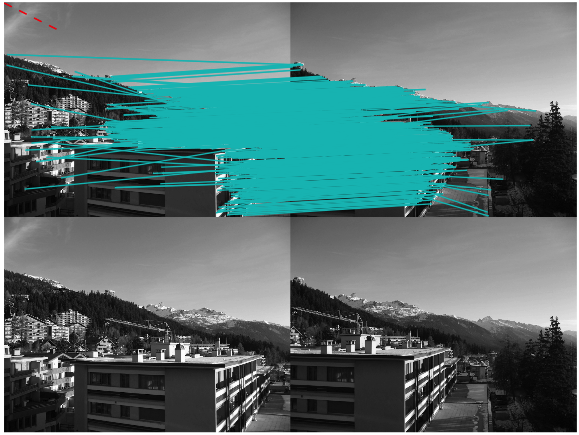

This project aims to check whether 2 images are near duplicate, and the method follows this paper.

[Near-Duplicate Keyframe Identification with
Interest Point Matching and Pattern Learning](http://www.cs.cityu.edu.hk/~wzhao2/papers/itm07.pdf)

